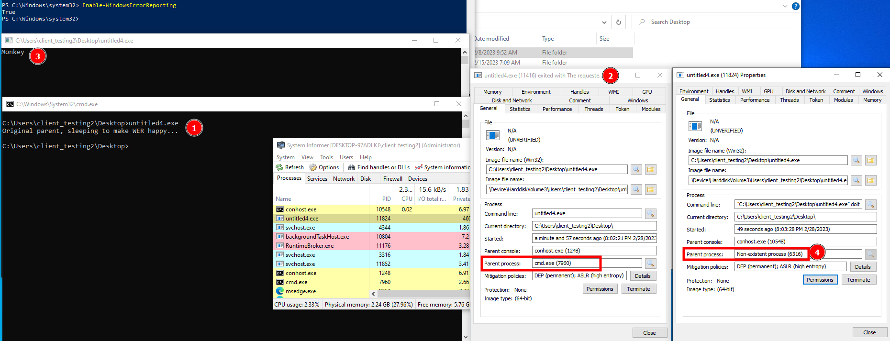

# RustWERBreakChain
"simple PoC for self-breaking own parent-child process chain" by gtworek.

Re-wrote it using the windows-sys Rust crate.




## Getting Started

### Dependencies
```
[dependencies.windows-sys]
version = "0.45.0"
features = [
    "Win32_Foundation",
    "Win32_System_Recovery",
]
```

### Executing program

building
```
cargo build --release
```
Running
```
cargo run --release
```

## Help

Make sure WER (Windows error reporting is active on the machine)
```
PS C:\Windows\system32> Enable-WindowsErrorReporting
True
```

## author
- PUNICODE_STRING

## Acknowledgments
Original discovery
* https://github.com/gtworek @0gtweet
* https://twitter.com/0gtweet/status/1629967880392458242